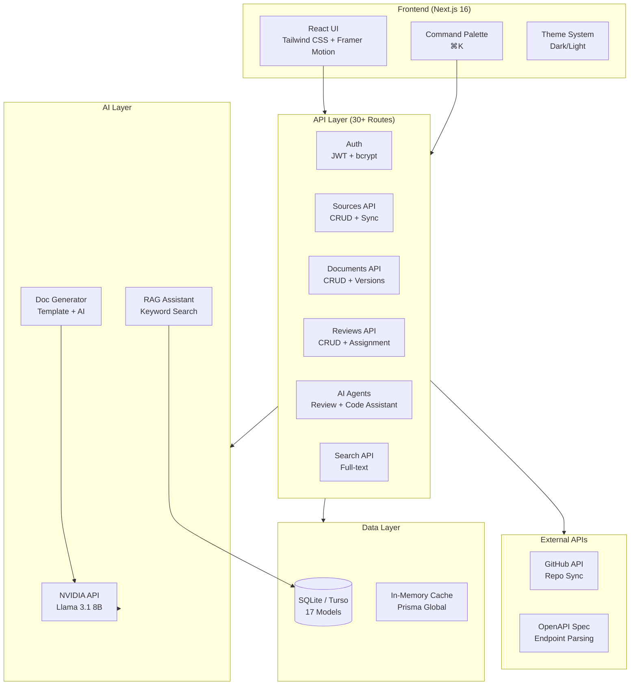
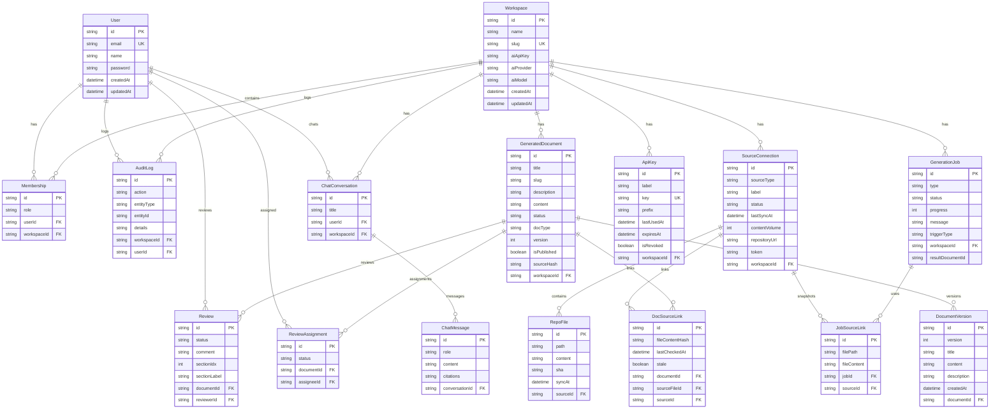
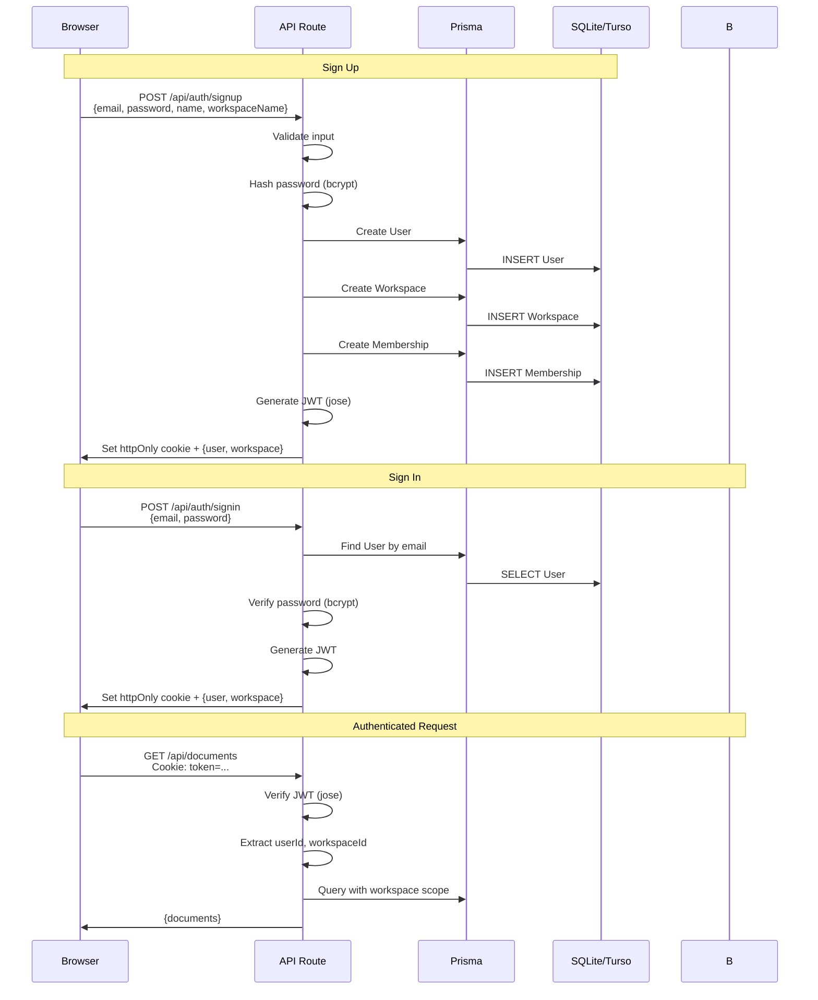
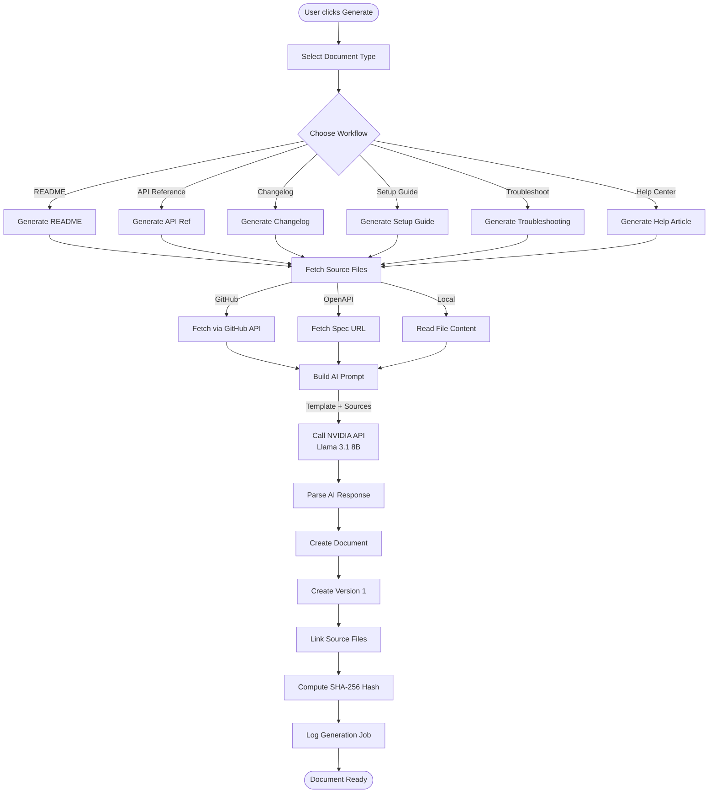
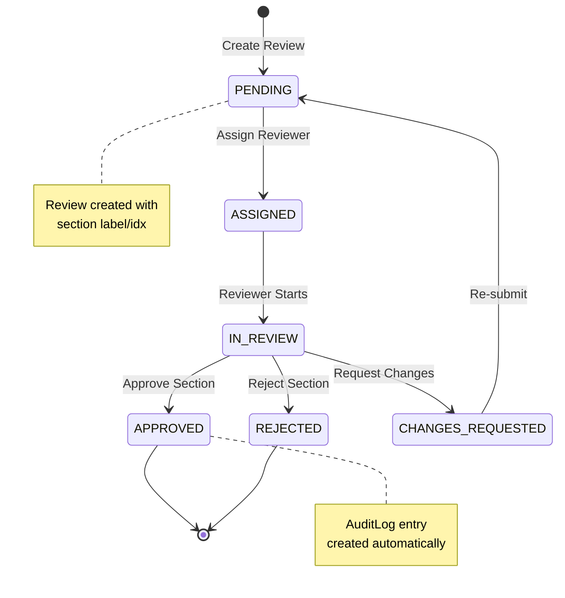
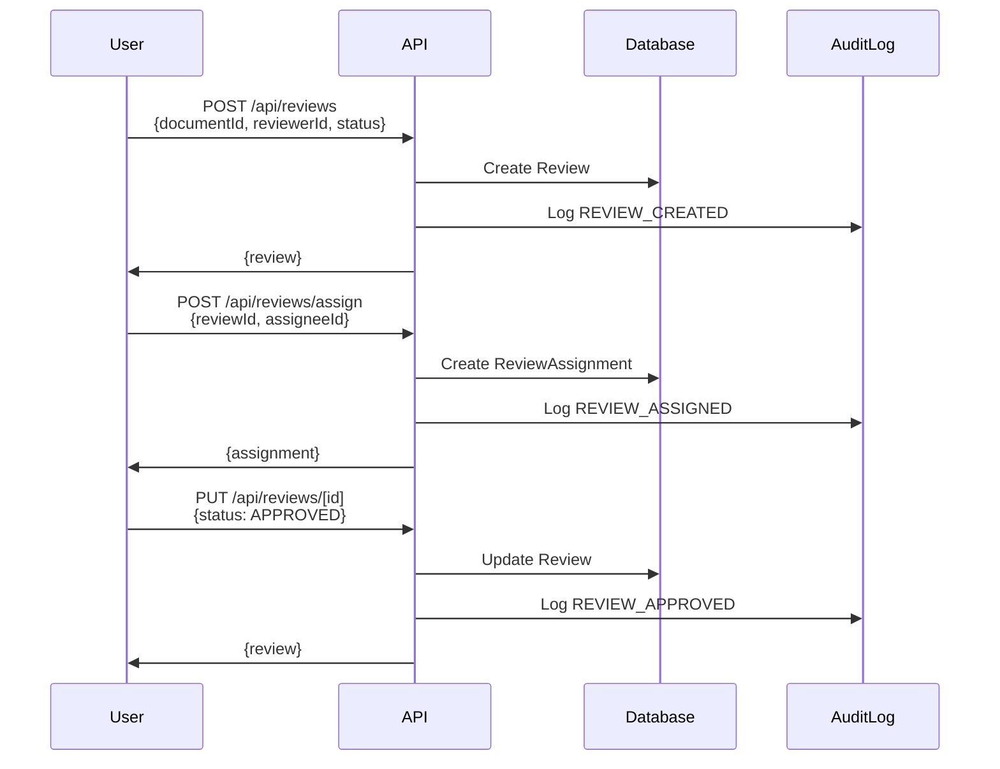
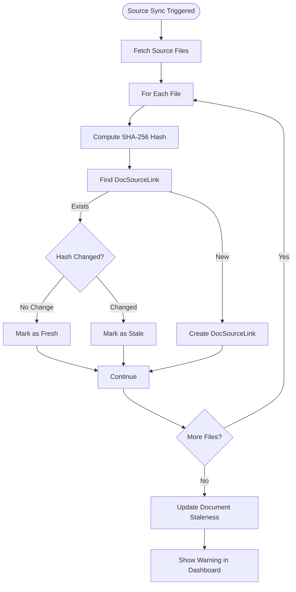
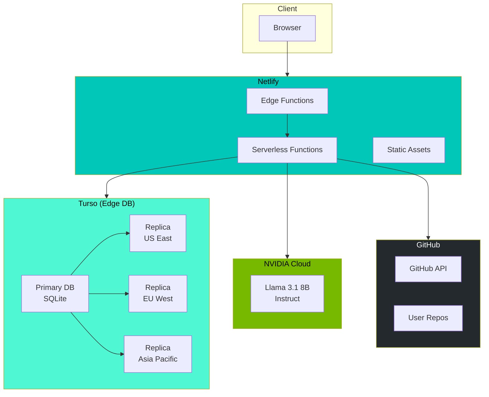
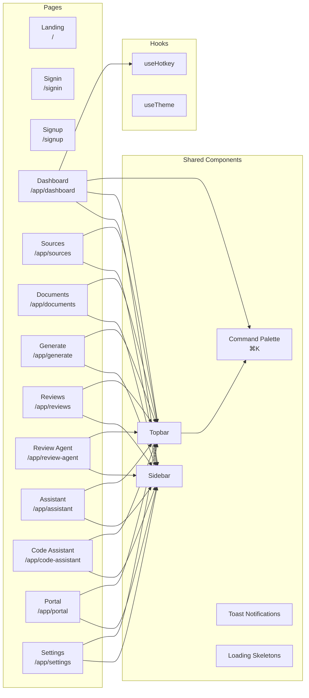

# Architecture

Technical architecture of DocFlow AI — an AI-powered documentation platform.

---

## System Overview

---

## Database Schema (ER Diagram)

---

## Auth Flow

---

## AI Generation Pipeline

---

## Review Workflow

---

## Staleness Detection

---

## Deployment Architecture

---

## Component Architecture

---

## Key Design Decisions

| Decision | Rationale |
|----------|-----------|
| **SQLite + Turso** | Local dev with file SQLite, production with edge-hosted Turso for persistence |
| **JWT over localStorage** | httpOnly cookies prevent XSS attacks |
| **bcryptjs (pure JS)** | Avoids native compilation issues across platforms |
| **Keyword search over vectors** | No vector DB dependency; RegExp scoring sufficient for MVP |
| **SHA-256 for staleness** | Content-based change detection without external webhooks |
| **NVIDIA Llama 3.1** | Free tier available, OpenAI-compatible API, good for code tasks |
| **Section-level reviews** | Finer granularity than document-level approve/reject |
| **Prisma global singleton** | Prevents connection exhaustion in serverless environments |
| **Prisma driver adapters** | Enables Turso/LibSQL without changing application code |
